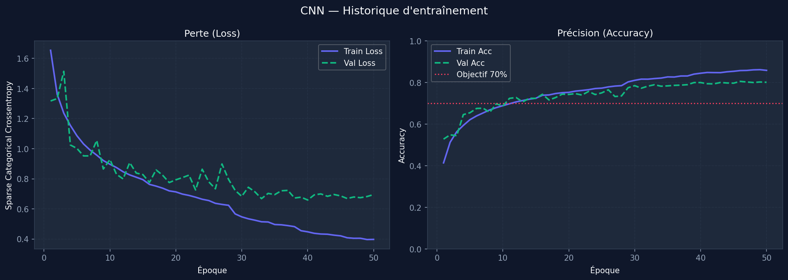
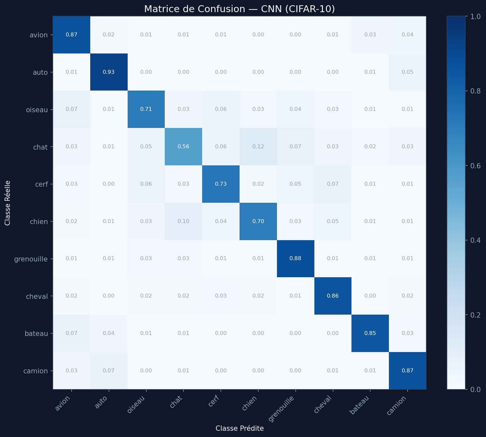
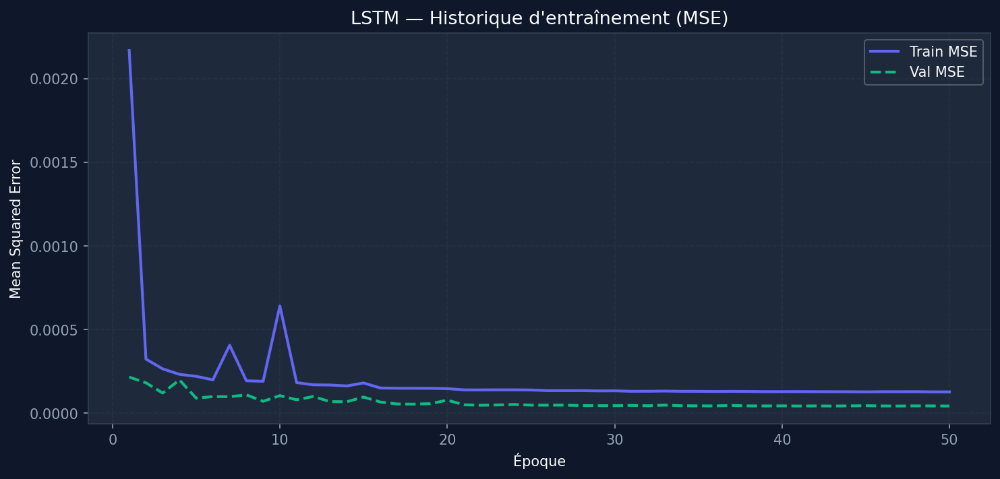
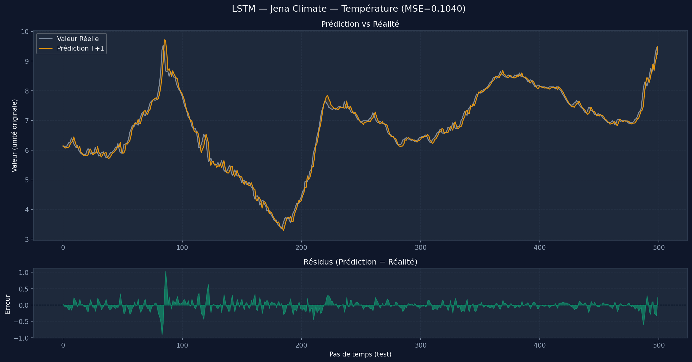

# NeuralBase

Backend FastAPI exposant deux modèles de deep learning entraînés sur des jeux de données publics :

- **Mission 1** — Classification d'images CIFAR-10 via un CNN personnalisé
- **Mission 2** — Prédiction de série temporelle (Jena Climate) via un LSTM empilé

L'interface web (`neuralbase.html`) se connecte directement à l'API locale.  
Le déploiement Render n'est plus disponible ; le projet tourne intégralement en local via `uvicorn`.

---

## Sommaire

- [Architecture du projet](#architecture-du-projet)
- [Prérequis](#prérequis)
- [Installation](#installation)
- [Entraînement des modèles](#entraînement-des-modèles)
- [Lancement de l'API](#lancement-de-lapi)
- [Endpoints disponibles](#endpoints-disponibles)
- [Mission 1 — CNN CIFAR-10](#mission-1--cnn-cifar-10)
- [Mission 2 — LSTM Jena Climate](#mission-2--lstm-jena-climate)
- [Résultats et visualisations](#résultats-et-visualisations)
- [Variables d'environnement](#variables-denvironnement)
- [Structure des fichiers](#structure-des-fichiers)
- [Limitations connues](#limitations-connues)

---

## Architecture du projet

```
neuralbase/
├── main.py                          # Backend FastAPI (API v2)
├── train.py                         # Script d'entraînement (CNN + LSTM)
├── evaluate.py           # Script d'évaluation post-entraînement
├── neuralbase.html                  # Interface web (client local)
├── requirements.txt
│
├── models/
│   ├── cnn_model.py                 # Architecture CustomCNN (Keras Subclassing)
│   ├── rnn_model.py                 # Architecture LSTMForecaster
│   └── saved/
│       ├── cnn_model.keras          # Poids CNN entraîné
│       └── rnn_model.keras          # Poids LSTM entraîné
│
├── utils/
│   ├── data_processing.py           # Pipelines tf.data (CIFAR-10 + Jena Climate)
│   └── visualization.py            # Graphiques matplotlib (historique, confusion, prédictions)
│
├── data/
│   └── jena_climate_2009_2016.csv   # Dataset Jena Climate (téléchargement automatique si absent)
│
└── results/
    ├── cnn_history.png
    ├── cnn_confusion_matrix.png
    ├── cnn_classification_report.txt
    ├── lstm_history.png
    ├── lstm_predictions.png
    └── lstm_metrics.txt
```

---

## Prérequis

- Python 3.9 ou 3.10 (TensorFlow 2.13 n'est pas compatible Python 3.11+)
- pip

---

## Installation

```bash
git clone [https://github.com/votre-utilisateur/neuralbase.git](https://github.com/monsieurMechant200/N-BASE.git)
cd N-BASE
pip install -r requirements.txt
```

Contenu de `requirements.txt` :

```
tensorflow==2.13.0
numpy==1.24.3
matplotlib==3.7.5
scikit-learn==1.3.2
fastapi==0.95.0
uvicorn[standard]==0.24.0
python-multipart==0.0.6
pillow==10.4.0
pandas==2.0.3
typing-extensions==4.5.0
```

---

## Entraînement des modèles

Les modèles doivent être entraînés avant de démarrer l'API. Les poids sont sauvegardés dans `models/saved/`.

**Entraîner les deux modèles :**

```bash
python train.py --mission all --epochs 50 --batch_size 64
```

**Entraîner uniquement le CNN :**

```bash
python train.py --mission cnn --epochs 50 --batch_size 64
```

**Entraîner uniquement le LSTM :**

```bash
python train.py --mission lstm --epochs 50 --batch_size 32
```

Le dataset Jena Climate est téléchargé automatiquement via `tf.keras.utils.get_file()` s'il est absent du dossier `data/`.

Les graphiques d'entraînement sont sauvegardés automatiquement :

- `results/cnn_history.png`
- `results/lstm_history.png`

---

## Lancement de l'API

```bash
uvicorn main:app --reload --port 8000
```

L'API est ensuite accessible à `http://localhost:8000`.  
La documentation interactive Swagger est disponible à `http://localhost:8000/docs`.

Pour utiliser l'interface web, ouvrez `neuralbase.html` directement dans votre navigateur (aucun serveur supplémentaire requis).

---

## Endpoints disponibles

| Méthode | Route             | Description                                      |
|---------|-------------------|--------------------------------------------------|
| GET     | `/`               | Redirige vers `/docs`                            |
| GET     | `/health`         | Statut des modèles chargés                       |
| GET     | `/model/info`     | Métadonnées complètes (paramètres, chemins, etc.)|
| POST    | `/predict/cnn`    | Classification d'image CIFAR-10                  |
| POST    | `/predict/lstm`   | Prédiction de série temporelle T+1               |

---

## Mission 1 — CNN CIFAR-10

### Architecture (`models/cnn_model.py`)

Le modèle `CustomCNN` est défini via l'API Subclassing de Keras et enregistré avec `@register_keras_serializable` pour permettre le rechargement via `load_model()`.

```
Data Augmentation (flip, rotation, zoom)
    └── Bloc 1 : Conv2D(32) → BatchNorm → MaxPooling
    └── Bloc 2 : Conv2D(64) → BatchNorm → MaxPooling
    └── Bloc 3 : Conv2D(128) → BatchNorm
    └── Flatten → Dense(256) → Dropout(0.4) → Softmax(10)
```

Les 10 classes reconnues sont : `avion`, `automobile`, `oiseau`, `chat`, `cerf`, `chien`, `grenouille`, `cheval`, `bateau`, `camion`.

### Pipeline de données (`utils/data_processing.py`)

- Normalisation des pixels dans `[0, 1]`
- Découpage 80/20 entraînement/validation
- Pipelines `tf.data.Dataset` avec `.shuffle()`, `.batch()`, `.prefetch(AUTOTUNE)`

### Utiliser l'endpoint CNN

```bash
curl -X POST http://localhost:8000/predict/cnn \
  -F "file=@mon_image.jpg"
```

Réponse JSON :

```json
{
  "success": true,
  "message": "Classe prédite : chien (87.3%)",
  "warning": null,
  "data": {
    "predicted_class": "chien",
    "confidence": 0.873,
    "confidence_level": "haute",
    "top3": [
      {"class": "chien", "probability": 0.873},
      {"class": "chat",  "probability": 0.071},
      {"class": "cerf",  "probability": 0.032}
    ],
    "all_probabilities": { "avion": 0.001, "...": "..." }
  }
}
```

### Résultats

| Métrique       | Valeur  |
|----------------|---------|
| Test Accuracy  | 79.52%  |
| Objectif       | 70% (atteint) |

Rapport de classification complet (`results/cnn_classification_report.txt`) :

```
              precision    recall  f1-score

       avion       0.75      0.87      0.81
        auto       0.85      0.93      0.88
      oiseau       0.76      0.71      0.74
        chat       0.72      0.56      0.63
        cerf       0.78      0.73      0.75
       chien       0.77      0.70      0.73
  grenouille       0.81      0.88      0.84
      cheval       0.81      0.86      0.83
      bateau       0.88      0.85      0.86
      camion       0.81      0.87      0.84

    accuracy                           0.80
```

### Visualisations CNN

Courbes d'entraînement (loss et accuracy) :



Matrice de confusion normalisée :



---

## Mission 2 — LSTM Jena Climate

### Architecture (`models/rnn_model.py`)

Le modèle `LSTMForecaster` prédit la valeur T+1 d'une série temporelle univariée.

```
LSTM(128, return_sequences=True) + L2(1e-4)
    └── Dropout(0.2)
    └── LSTM(64, return_sequences=False) + L2(1e-4)
    └── Dropout(0.2)
    └── Dense(1)
```

### Pipeline de données (`utils/data_processing.py`)

- Normalisation `MinMaxScaler` dans `[0, 1]`
- Découpage chronologique 70% / 15% / 15% (train / val / test)
- Fenêtres glissantes de longueur 24 via `tf.keras.utils.timeseries_dataset_from_array`

### Utiliser l'endpoint LSTM

La séquence d'entrée doit être normalisée avec un `MinMaxScaler [0, 1]` de 24 valeurs consécutives.

```bash
curl -X POST http://localhost:8000/predict/lstm \
  -H "Content-Type: application/json" \
  -d '{"sequence": [0.42, 0.45, 0.47, 0.50, 0.48, 0.46, 0.44, 0.43,
                    0.41, 0.40, 0.39, 0.38, 0.37, 0.36, 0.35, 0.34,
                    0.33, 0.34, 0.36, 0.38, 0.40, 0.42, 0.43, 0.44]}'
```

Réponse JSON :

```json
{
  "success": true,
  "message": "Prédiction T+1 : 0.4512",
  "warning": null,
  "data": {
    "prediction_t_plus_1": 0.451234,
    "sequence_length_used": 24
  }
}
```

### Résultats

| Métrique  | Valeur   |
|-----------|----------|
| Test MSE  | 0.1040   |
| Test MAE  | 0.2100   |
| Test RMSE | 0.3224   |

### Visualisations LSTM

Courbes d'entraînement (MSE) :



Prédictions vs valeurs réelles + courbe des résidus :



---

## Évaluation post-entraînement

Le script `evaluate.py` recharge les modèles sauvegardés et régénère toutes les figures et métriques.

```bash
# Évaluer les deux modèles
python evaluate.py --mission all

# Évaluer uniquement le CNN
python evaluate.py --mission cnn

# Évaluer uniquement le LSTM
python evaluate.py --mission lstm

# Chemins personnalisés
python evaluate.py --mission cnn --cnn_path models/saved/cnn_model.keras
```

Le script gère automatiquement le fallback d'extension `.keras` vers `.h5` si le format principal est absent.

---

## Variables d'environnement

| Variable          | Défaut                        | Description                        |
|-------------------|-------------------------------|------------------------------------|
| `CNN_MODEL_PATH`  | `models/saved/cnn_model.keras`| Chemin vers le modèle CNN          |
| `LSTM_MODEL_PATH` | `models/saved/rnn_model.keras`| Chemin vers le modèle LSTM         |
| `MAX_IMAGE_MB`    | `10`                          | Taille max des images uploadées    |
| `ALLOWED_ORIGINS` | `*`                           | Origines CORS autorisées           |

---

## Structure des fichiers de résultats

Tous les fichiers générés sont placés dans le dossier `results/` :

| Fichier                          | Contenu                                           |
|----------------------------------|---------------------------------------------------|
| `results/cnn_history.png`        | Courbes loss et accuracy CNN                      |
| `results/cnn_confusion_matrix.png` | Matrice de confusion normalisée CIFAR-10        |
| `results/cnn_classification_report.txt` | Précision, rappel, F1 par classe           |
| `results/lstm_history.png`       | Courbes MSE entraînement/validation LSTM          |
| `results/lstm_predictions.png`   | Prédictions vs réalité + résidus                  |
| `results/lstm_metrics.txt`       | MSE, MAE, RMSE sur le jeu de test                 |

---

## Limitations connues

**CNN / CIFAR-10**

- CIFAR-10 ne contient pas de classe "humain" ou "personne". Les photos de personnes produiront systématiquement un résultat non fiable.
- Les images sont redimensionnées en 32x32 pixels avant inférence. Les photos haute résolution perdent une grande partie de leur information.
- Un avertissement est retourné dans la réponse si la confiance est inférieure à 40%.

**LSTM / Série temporelle**

- Le modèle attend une séquence normalisée dans `[0, 1]` via `MinMaxScaler`. Toute valeur hors de cette plage déclenche un avertissement.
- La prédiction est univariée (une seule variable d'entrée, une valeur de sortie T+1).

**Déploiement**

- Le déploiement sur Render n'est plus disponible. L'application fonctionne uniquement en local via `uvicorn main:app --reload --port 8000`.
- Les poids des modèles (fichiers `.keras` / `.h5`) ne sont pas versionnés dans ce dépôt en raison de leur taille. Il est nécessaire de les générer localement via `python train.py --mission all`.
